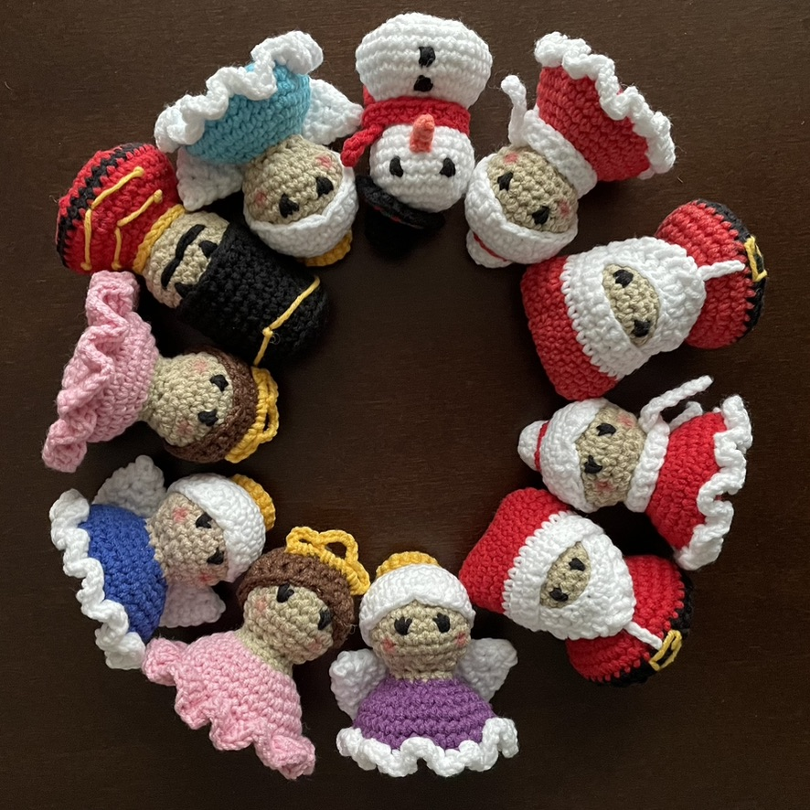

# Jak wyszydełkować amigurumi<!-- omit in toc -->

**Amigurumi** jest japońską sztuką robienia na drutach lub szydełkowania małych, wypchanych zabawek z włóczki.

Czego potrzebujesz:
- [Włóczka](#włóczka)
  - [Typy i kolory](#typy-i-kolory)
    - [Typy](#typy)
    - [Kolory](#kolory)
- [Kulka silikonowa](#kulka-silikonowa)
- [Narzędzia](#narzędzia)
  - [Szydełko](#szydełko)
  - [Igła dziewiarska](#igła-dziewiarska)
  - [Znaczniki dziewiarskie](#znaczniki-dziewiarskie)

Szydełkowanie amigurumi może być dobrą zabawą.

Po prostu musisz spróbować sam.  

**Gotowy?**

**Do startu.**

__Szydełkuj!__

To bardzo _proste_.
*Nie* tak trudne jak niektórzy myślą.

To ~~nie~~ sprawi, że się uśmiechniesz.

# Włóczka
## Typy i kolory
### Typy

[Typy włóczek możesz sprawdzić tutaj](https://www.cuddlystitchescraft.com/best-yarn-for-making-amigurumi/)

[A tutaj dowiesz się więcej o włóczce akrylowej i bawełnianej](YarnTypes.md)

### Kolory

# Kulka silikonowa
**Kulka silikonowa** to szybkoschnące sztuczne wypełnienie do poduszek odporne na pleśń.

Kulkę silikonową znajdziesz [tutaj](https://allegro.pl/listing?string=kulka%20silikonowa&order=p).

# Narzędzia
Aby rozpocząć szydełkowanie amigurumi, będziesz potrzebować następujących narzędzi:

## Szydełko

## Igła dziewiarska

## Znaczniki dziewiarskie

> Realizacja swojego hobby jest stratą czasu. Nikt tak nigdy nie powiedział.

Kilka marek włóczek:
- Yarn Art Jeans
- Yarn Art Jeans Plus
- Himalaya Dolphin Baby

Więcej marek włóczek:  
1. Yarn Art Jeans Crazy
2. Gazzal Baby Cotton
3. Drops Baby Merino

| Numer włóczki | Marka włóczki     | Kolor    |
| ----------- | -------------- | ---------- |
| 01          | Yarn Art Jeans | Biały     |
| 20          | Yarn Art Jeans | Jasnoróżowy |
| 35          | Yarn Art Jeans | Żółty     |

To kilka przykładów kolorów włóczek.

Więcej kolorów włóczek znajdziesz [tutaj](https://www.olimoripasmanteria.pl/kategoria-produktu/wloczki/jeans/).
